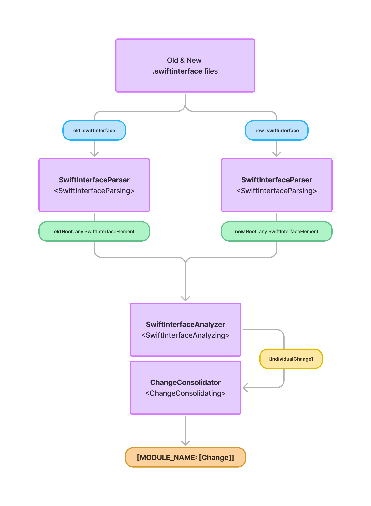

# ``PADSwiftInterfaceDiff``

The ``SwiftInterfaceDiff`` consumes a list of ``PADCore/SwiftInterfaceFile``s and detects changes between the old and new version

## Usage

```swift
let swiftInterfaceFiles: [SwiftInterfaceFile] = ...

let swiftInterfaceDiff = SwiftInterfaceDiff()

let changes: [String: [Change]] = try await swiftInterfaceDiff.run(
    with: swiftInterfaceFiles
)
```

## How it works


## Consolidating individual Changes
### Match

### No Match

### False positive

