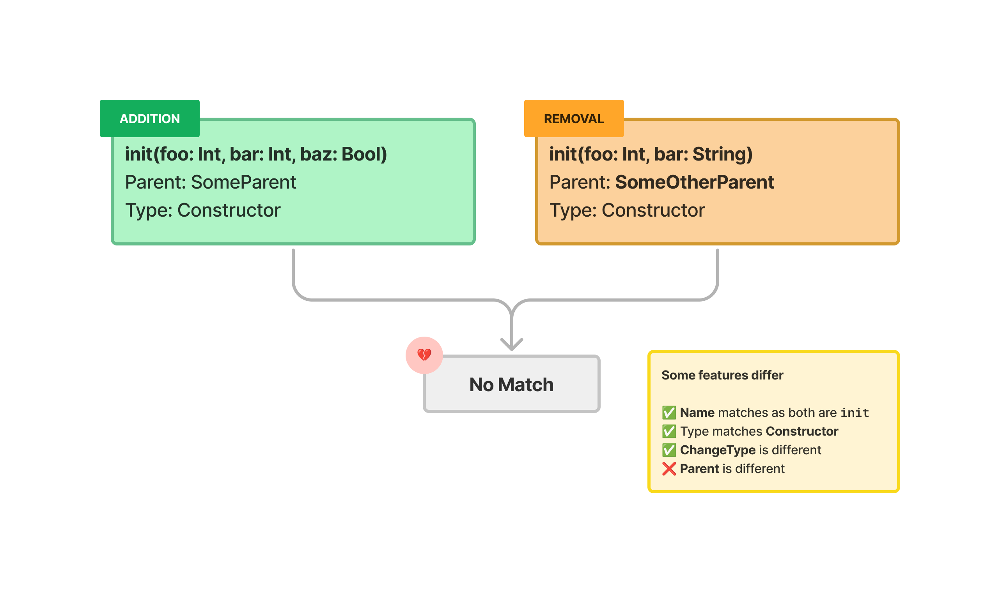

# ``PADSwiftInterfaceDiff``

The ``PADSwiftInterfaceDiff`` consumes a list of ``PADCore/PADSwiftInterfaceFile``s and detects changes between the old and new version

## Usage

```swift
let swiftInterfaceFiles: [PADSwiftInterfaceFile] = ...

let swiftInterfaceDiff = PADSwiftInterfaceDiff()

let changes: [String: [PADChange]] = try await swiftInterfaceDiff.run(
    with: swiftInterfaceFiles
)
```

## How it works


## Consolidating individual Changes
### Match

### No Match

### False positive

